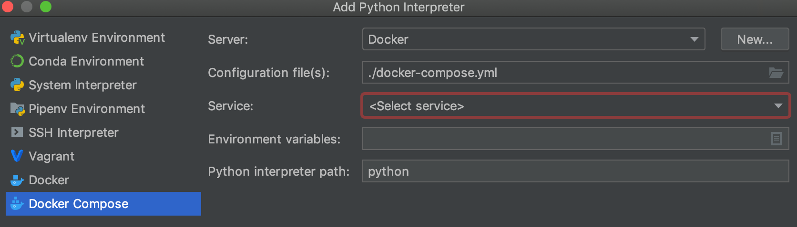

# For python language playground

## runtime

- python runtime suggest to use docker

```bash
# use makefile to build images
$ make dockerImagesBuild
```

- change proxy of pip before run `make dockerImagesBuild` at file [./Dockerfile](./Dockerfile)

```Dockfile
RUN pip config set global.index-url https://pypi.tuna.tsinghua.edu.cn/simple \
```

- install more package can change file [./requirements.txt](./requirements.txt)

> must use `make dockerImagesBuild` after change requirements.txt 

## use in PyCharm

- in `settings` -> `Python Interpreter`
- Click the `gear button` on the right, and press `add..`


- select `Docker Compose`



> if `Server:` is empty can click `New...` button add docker engine

- select `Services:`, by file [./docker-compose.yml](./docker-compose.yml)
- add some `Enviroment variables:`


- then pass `Ok`